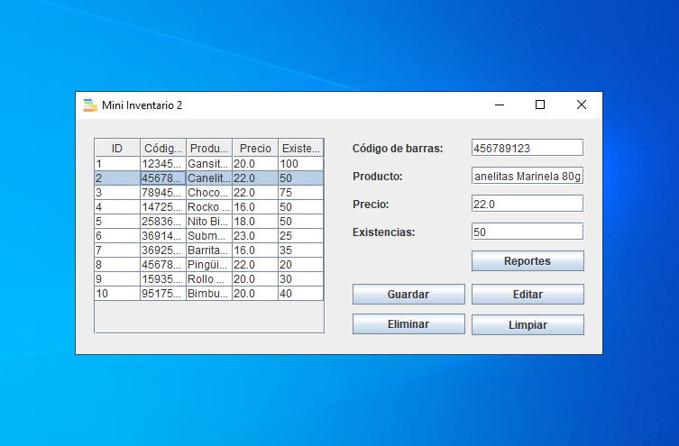
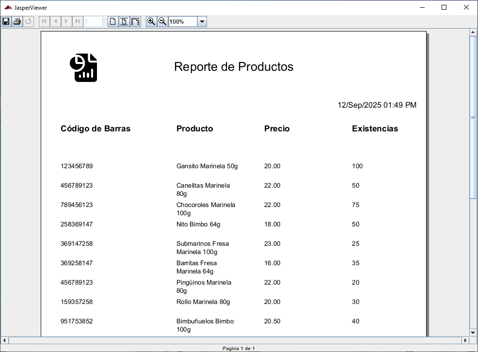

# Mini Inventario 2
Sistema para control de productos alimenticios desarrollado en Java con CRUD completo y generación de reportes en PDF.

## Tabla de contenido
- [Características principales](#características-principales)
- [Screenshots](#screenshots)
- [Tecnologías utilizadas](#tecnologías-utilizadas)
- [Requerimientos](#requerimientos)
- [Instalación](#instalación)
- [Desarrollo](#desarrollo)
- [Licencia](#licencia)

## Características principales
- CRUD de productos (Crear, Leer, Actualizar, Eliminar).
- Interfaz gráfica desarrollada con Java Swing.
- Visualización de registros en tabla dinámica.
- Generación de reportes **PDF** con logotipo, fecha actual y listado de productos (Jaspersoft).

## Screenshots

### Pantalla principal

> Pantalla principal con datos de prueba

### Pantalla de reportes

> Pantalla de previsualización de reportes

📂 Puedes ver más capturas en la carpeta [/screenshots](screenshots/).

## Tecnologías utilizadas
**Frontend**
- Java Swing
- Jasper Reports

**Backend**
- Java

**Base de datos**
- MariaDB 12.0.2

**Software**
- Eclipse IDE 2025-03
- Jaspersoft Studio 7.0.2

## Requerimientos
- [Java JDK 23](https://download.oracle.com/java/23/archive/jdk-23.0.1_windows-x64_bin.exe)
- [MariaDB 12.0.2](https://mariadb.org/download/)

## Instalación

### 1. Crear base de datos
- Abre la consola de MariaDB
- Ingresa con usuario: **root** (sin contraseña por defecto).
- Copia y ejecuta el [esquema](database/scheme.sql) que se encuentra en el repositorio.
- Crea al usuario para el programa ejecutando la instrucción [seed](database/seed.sql).

### 2. Descargar el proyecto
Puedes descargar la versión más reciente de Mini Inventario 2 desde [GitHub Releases](https://github.com/mendozarojasdev/mini-inventario-java/releases/latest).

### 3. Instalar ejecutable
- Ejecutar el `.exe` para comenzar la instalación
- El programa se instalará por defecto en la ruta `C:\Users\(Usuario)\AppData\Local\Inventario\`, también es posible realizar la instalación en una ruta diferente p. ej. `C:\Program Files\Mini Inventario 2`, pero en este caso el ejecutable se debe ejecutar con privilegios de administrador.

## Desarrollo
Si deseas continuar con el desarrollo del proyecto.

### Requerimientos
- [Eclipse IDE for Java Developers](https://eclipseide.org/)
- [Jaspersoft Software](https://community.jaspersoft.com/download-jaspersoft/community-edition/) (Si se requiere editar el formato de reporte)
- [Java JDK 23](https://download.oracle.com/java/23/archive/jdk-23.0.1_windows-x64_bin.exe)
- [MariaDB 12.0.2](https://mariadb.org/download/)
- [MariaDB Connector/J (JDBC) 3.5.2](https://dlm.mariadb.com/4174416/Connectors/java/connector-java-3.5.2/mariadb-java-client-3.5.2.jar)
- [Jasper Reports Libraries](https://mvnrepository.com/artifact/net.sf.jasperreports/jasperreports)
- [Jasper Reports PDF Libraries](https://mvnrepository.com/artifact/net.sf.jasperreports/jasperreports-pdf/)

### Instrucciones
- Sigue las [instrucciones](#1-crear-base-de-datos) mencionadas anteriormente para crear la base de datos.
- Clona este proyecto y copia la carpeta MiniInventario2 en tu `/eclipse-workspace`
- Guarda `mariadb-java-client-3.5.2.jar` y las librerías `.jar` de Jasper Reports en una ubicación p. ej. `C:\Program Files\Java\jdk-23\lib\mariadb-jdbc` y `C:\Program Files\Java\jdk-23\lib\jasper-reports`
- Importar librerías al proyecto en Eclipse IDE:

```ini
MiniInventario2 > build path > add libraries...
new > name: mariadb-jdbc
# No seleccionar la opcion [System library]
add external jars...
# Buscar conector en C:\Program Files\Java\jdk-23\lib\mariadb-jdbc
```
Realizar el mismo procedimiento para las librerías de Jasper Reports.

✅ Listo, ahora podrás continuar con el desarrollo del proyecto.

## Licencia
Mini Inventario 2 está publicado bajo la licencia MIT. Consulta el archivo [MIT license](https://github.com/mendozarojasdev/mini-inventario-java/blob/master/LICENSE) para más información.
